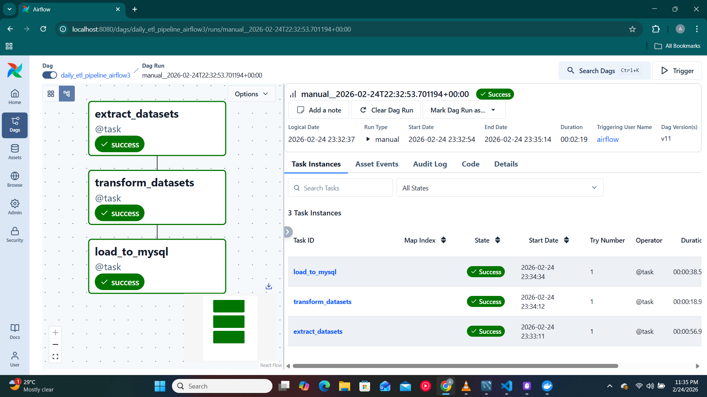
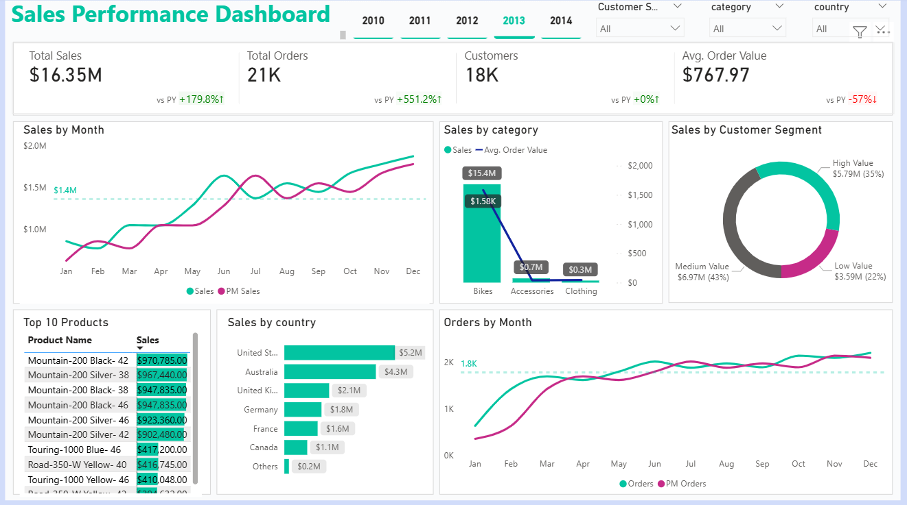

# Airflow ETL Sales Analytics Pipeline

An end-to-end Data Engineering and Analytics project that builds an automated ETL pipeline using Apache airflow to extract, transform and load datasets into a structured analytical database where analytics is carried out.  
This project demonstrates workflow orchestration, data transformation, containerization, CI validation of Airflow DAGs using Github Actions, data analytics and visualization.

---
## Contents
-[Project Overview](#project-overview)     
-[Repo Structure](#repo-structure)  
-[Tools](#tools)  
-[Data Pipeline Workflow](#data-pipeline-workflow)   
-[Airflow DAG](#airflow-dag)  
-[CI/CD Workflow](#cicd-workflow)   
-[Data Model](#data-model)    
-[Screenshot](#screenshot)  
-[Data Analysis with SQL](#analysis-with-sql)    
-[Power BI Dashboard](#powerbi-dashboard)   
-[Data Flow](#data-flow)

---
## Project Overview
This project implement a mordern ETL pipeline orchestrated with Apache Airflow as well as data analytics and visualization.

The Pipeline:
1. Extracts raw CSV datasets
2. Cleans and transform datasets
3. Creates dimensional and facts tables
4. Loads processed data into a relational database
5. Automates execution using scheduled DAGs

The goal of the pipeline is to simulate a real world analytics data warehouse pipeline.

---
## Repo Structure
```bash
Airflow-ETL-Sales-Anslytics-Pipeline-
│
├── analytics/
│   ├── business_analysis.sql
│   ├── data_exploratory.sql
│   ├── kpi_reports.sql
│   └── views.sql
├── dags/
│   ├── airflow-ui.png
│   └── etl_dag.py
├── database/
│   └── db_creation.sql
├── dashboard/
│   ├── dashboard.png
│   └── sales dashboard_preview.pbix
├── Workflow/
│   └──validate-dags.yml
└── README.md
```

---
## Tools
- Docker
- Apache Airflow
- Python
- MySQL
- Power BI
- GitHub Actions (CI/CD)
- Git

---
## Data Pipeline Workflow
### Extract
- Read multiple CSV datasets
- Stores datasets as airflow XCom

### Transform
- Clean missing values
- Merges datasets
- Generates:
  - `dim customers`
  - `dim-products`
  - `fact-sales`

### Load
- Inserts generated tables into MySQL database

---
## Airflow DAG
The DAG uses the Taskflow API to define dependencies:  
```
extract → transform → load
```

Features:
- Task Isolation
- Automatic retries
- Logging and monitoring
- Scalable orchestration

---
## CI/CD Workflow
[Github Actions](https://github.com/al3x-id/Airflow-ETL-Sales-Analytics-Pipeline-/tree/main/workflows) automatically:
- Installs Airflow
- Initializes Airflow database
- Validate DAG parsing
- Prevents broken DAGs from merging

Workflow repo: [Link](https://github.com/al3x-id/airflow_dags)

---
## Data Model
### Dimension Tables
- `dim_customers`
- `dim_products`

### Fact Table
- `fact_sales`

---
## Screenshot


---
## Data Analysis with SQL
After loading transformed datasets into MySQL, analytical queries are performed to generate business insights from the warehouse.

The database follows a star schema enabling efficient aggregation and reporting.

[Check Script](https://github.com/al3x-id/Airflow-ETL-Sales-Analytics-Pipeline-/blob/main/analytics%2Fbusiness_analysis.sql)

### Analysis Objectives
- Understand Customer purchasing behaviour
- Identify top-performing products
- Analyze sales trends over time
- Evaluate revenue distribution by region
- Generate KPIs for business reporting

---
The analytical [views](https://github.com/al3x-id/Airflow-ETL-Sales-Analytics-Pipeline-/blob/main/analytics%2Fviews_analysis.sql) created in MySQL are connected to Power BI to build interactive business intelligence dashboard.

Power BI uses SQL views instead of raw tables, ensuring:
- Consistent business logic
- Faster dashboard performance
- Scalable reporting architechture

### Dashboard Features
- Top performing products
- Monthly Revenue growth rates
- Customer segmentation analysis
- Top preferred categories
- Yearly Sales trend



---
## Data Flow
```
Airflow ETL
    ↓
fact & dimension tables
    ↓
business_queries SQL
    ↓
views (analytics layer)
    ↓
Power BI dashboards

```
